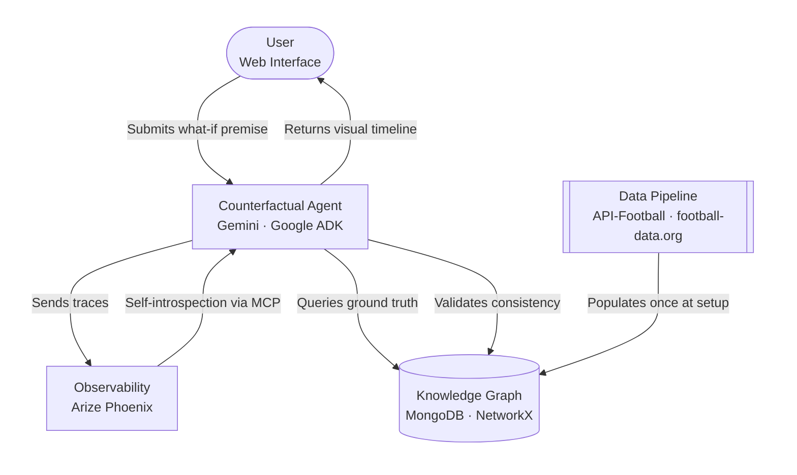

```mermaid
graph TD
    subgraph INPUT[" "]
        User(["User\nWeb Interface"])
    end

    subgraph CORE[" "]
        Agent["Counterfactual Agent\nGemini · Google ADK"]
    end

    subgraph STORAGE[" "]
        KG[("Knowledge Graph\nMongoDB · NetworkX")]
    end

    subgraph MONITORING[" "]
        Phoenix["Observability\nArize Phoenix"]
    end

    subgraph INGESTION[" "]
        Pipeline[["Data Pipeline\nAPI-Football · football-data.org"]]
    end

    User -->|"Submits what-if premise"| Agent
    Agent -->|"Returns visual timeline"| User
    Agent -->|"Queries ground truth"| KG
    Agent -->|"Validates consistency"| KG
    Agent -->|"Sends traces"| Phoenix
    Phoenix -->|"Self-introspection via MCP"| Agent
    Pipeline -->|"Populates once at setup"| KG

    style INPUT fill:none,stroke:none
    style CORE fill:none,stroke:none
    style STORAGE fill:none,stroke:none
    style MONITORING fill:none,stroke:none
    style INGESTION fill:none,stroke:none
```
#Control+shift+v for preview