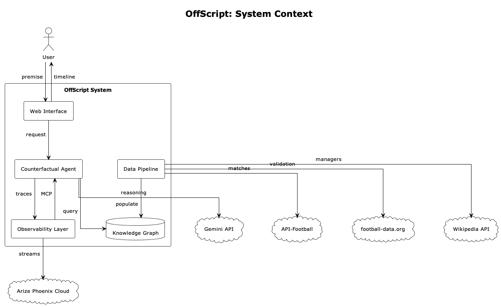
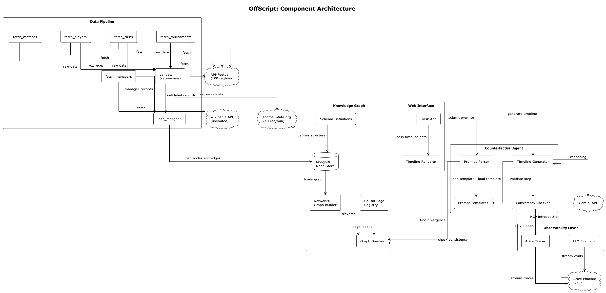
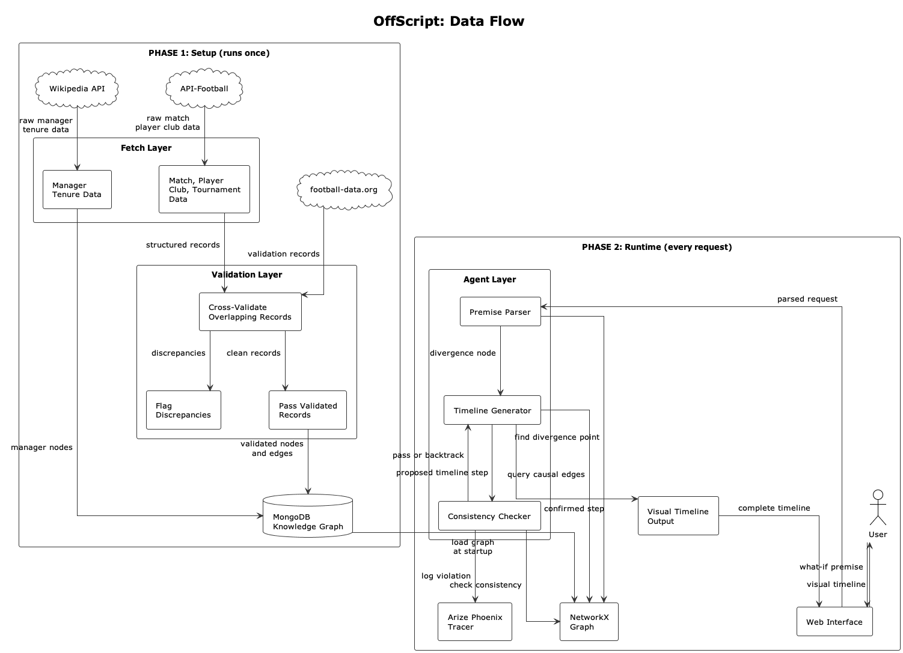
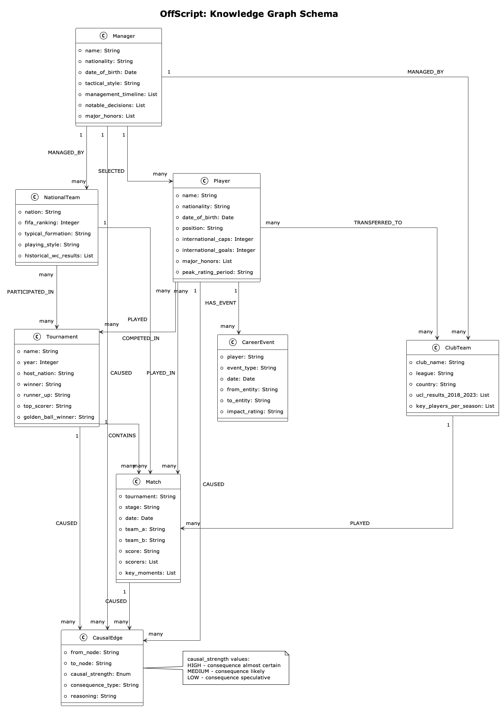
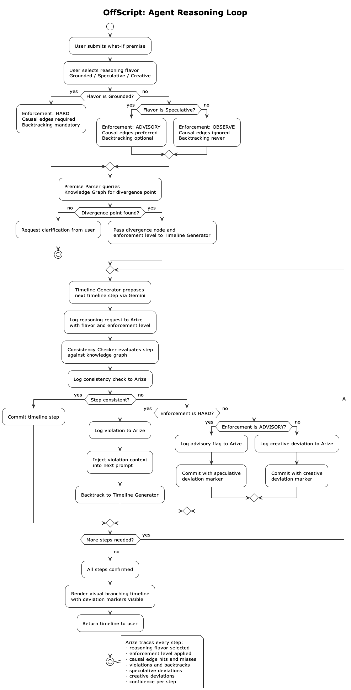

# OffScript: Architecture Documentation

OffScript is a counterfactual football timeline engine. Given a what-if premise Eg. "What if France won the 2022 World Cup?" — the system generates a causally consistent alternate history grounded in a structured football knowledge graph, with every reasoning step traced and evaluated for consistency.

---

## Table of Contents

1. [System Context](#1-system-context)
2. [Component Architecture](#2-component-architecture)
3. [Data Flow](#3-data-flow)
4. [Knowledge Graph Schema](#4-knowledge-graph-schema)
5. [Agent Reasoning Loop](#5-agent-reasoning-loop)
6. [Design Decisions](#6-design-decisions)
7. [Known Constraints](#7-known-constraints)

---

## 1. System Context

The system context diagram shows who interacts with OffScript and what external services it depends on.

The OffScript system boundary contains five internal components. Outside it are five external dependencies split into two categories: runtime dependencies the agent needs during every request (Gemini API, Arize Phoenix Cloud), and setup dependencies the data pipeline needs once during graph population (API-Football, football-data.org, Wikipedia API).

---

## 2. Component Architecture

The component architecture diagram shows what lives inside each system and how components interface with each other.

The Data Pipeline has two distinct internal flows. Structured data — matches, players, clubs, tournaments — is fetched from API-Football, cross-validated against football-data.org, and loaded into MongoDB. Manager data is fetched from Wikipedia and loaded directly, bypassing validation since no second source exists for cross-referencing.

The Knowledge Graph layer separates storage from traversal. MongoDB is the persistent store. NetworkX loads from MongoDB at startup and handles all in-memory graph traversal during agent reasoning. Schema definitions and the causal edge registry are locked before any agent operation begins.

The Counterfactual Agent has three distinct components with clear boundaries. The Premise Parser identifies divergence points. The Timeline Generator produces candidate steps via Gemini. The Consistency Checker validates each step against the knowledge graph before it is committed.

---

## 3. Data Flow

The data flow diagram shows how data moves through the system across two completely separate phases.

Phase 1 runs once at setup. Raw data is fetched from external APIs, validated where two sources overlap, and loaded into MongoDB. After this phase the Data Pipeline is inactive.

Phase 2 runs on every user request. The knowledge graph is pre-loaded into NetworkX at startup. Every request flows through the agent reasoning loop — premise parsing, step generation, consistency checking, and timeline rendering. The two phases share only one connection point: MongoDB loading into NetworkX at startup.

---

## 4. Knowledge Graph Schema

The schema diagram shows every node type, their properties, and the relationships between them.

Seven node types form the ground truth layer: Player, Manager, NationalTeam, ClubTeam, Tournament, Match, and CareerEvent. CausalEdge is a first-class node rather than a simple relationship property. This design decision is deliberate — treating causal relationships as queryable nodes allows the consistency checker to filter by causal strength, traverse consequence chains, and reason about what must change downstream from a divergence point.

CausalEdge carries three key properties. `causal_strength` is an enum with values HIGH, MEDIUM, and LOW representing how certain a consequence is. `consequence_type` categorizes the kind of change — legacy, tactical, commercial, or transfer. `reasoning` stores a human-readable explanation of why the causal relationship exists, used as context in generation prompts.

---

## 5. Agent Reasoning Loop

The agent reasoning loop diagram shows the step-by-step process for handling a single user request.

The loop has three properties that separate it from a naive LLM wrapper.

First, constrained generation. The Timeline Generator does not produce steps freely — each proposed step is validated against the knowledge graph before being committed. A failed check triggers a backtrack, injecting the violation details into the next generation prompt so Gemini is explicitly aware of what went wrong.

Second, full observability. Arize Phoenix traces every reasoning request, every consistency check result, every violation, and every backtrack. This produces a complete audit trail of how the agent thinks across a full timeline generation, enabling LLM-as-a-Judge evaluation after the fact.

Third, defensive clarification. If the user's premise does not map to any divergence point in the knowledge graph, the system requests clarification rather than hallucinating a divergence. This prevents the agent from generating plausible-sounding but groundless timelines.

Fourth, three reasoning flavors. The system supports Grounded, Speculative, and Creative modes selected by the user before generation begins. Grounded mode enforces hard constraints — every step must be supported by a causal edge, violations trigger mandatory backtracking. Speculative mode runs the consistency checker in advisory mode — causal edges are preferred but creative extensions are allowed and flagged. Creative mode observes only — Gemini reasons freely, the consistency checker logs deviations without blocking anything. All three modes produce full Arize traces, enabling comparative analysis across flavors for the same premise.

---

## 6. Design Decisions

**Knowledge graph as ground truth over prompt engineering alone**

Relying purely on Gemini's internal knowledge to maintain consistency across a multi-step counterfactual timeline produces incoherent results. Facts drift, contradictions compound, and there is no mechanism to catch failures. Grounding every reasoning step in a structured graph with explicit causal relationships makes consistency checkable and violations detectable.

**CausalEdge as a first-class node**

Storing causal relationships as simple graph edges would make them queryable only by traversal. Promoting them to full nodes with typed properties — strength, consequence type, reasoning — makes them filterable, rankable, and injectable into generation prompts directly. This is the core technical contribution of the knowledge graph design.

**MongoDB for persistence, NetworkX for traversal**

MongoDB provides persistent storage that survives process restarts. NetworkX provides fast in-memory graph traversal during agent reasoning. Using both together gives persistence without sacrificing traversal performance. The graph loads from MongoDB at startup — rebuilding is never necessary.

**Tiered data sourcing with full cross-validation**

API-Football is the primary data source for all structured football data. football-data.org cross-validates every overlapping record — match scores, tournament results, standings. Wikipedia provides manager tenure data which has no second source. This separation ensures that each source is used for what it does best, and that ground truth integrity is verified before any data enters the knowledge graph.

**Rate-aware validation pipeline**

football-data.org's free tier allows 10 requests per minute. The validation pipeline is designed with configurable request throttling and spreads ingestion across multiple days where necessary. This is a deliberate engineering constraint, not a limitation — it keeps infrastructure costs at zero during development.

---

## 7. Known Constraints

**Knowledge graph scope**

The graph covers 2018 and 2022 World Cups fully, Champions League results for approximately 20 key clubs from 2018 to 2023, approximately 50 high-consequence players, and approximately 15 to 20 managers. This scope was chosen deliberately to maximize relationship density over data breadth, which directly improves consistency checker effectiveness. The architecture supports expansion — adding new competitions requires populating new nodes with the existing schema, no structural changes needed.

**API rate limits**

API-Football free tier allows 100 requests per day. Graph population is spread across multiple days within this constraint. Upgrading to the Pro tier at $19 per month removes this constraint entirely if needed.

**Causal edge authorship**

Causal edges are manually curated with domain expertise rather than auto-generated. This is a deliberate quality decision — auto-generated causal relationships would undermine the ground truth guarantee the consistency checker depends on. Approximately 50 high-consequence edges are defined covering the most likely counterfactual scenarios.

---